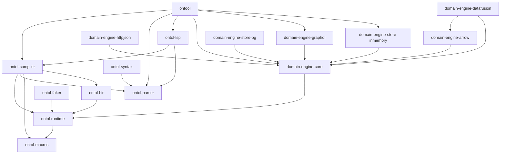

# Domain Engine

A domain description and mapping engine.

This repo is a workspace with multiple inter-dependent crates.

## ONTOL

A domain description and mapping _language_.

The name is a silly spin on ALGOL (for algorithms!), this is a language for
ontologies.

### Language fundamentals

Work in progress. See
[MDP 6](https://gitlab.com/protojour/x-design-proposals/-/issues/8).

## ONTOL Architecture

High level data flow:

1. Create _compiler_. The compiler is single threaded.
2. Feed domain source code into the compiler.
3. The compiler finally produces a shared, immutable and thread safe
   _ontology_.
4. Execute code by creating a _virtual machine_ which holds a reference to the
   ontology.

Any number of virtual machines may be created and executed in parallel, because
of the immutable ontology.

The _domain engine_ encapsulates the ONTOL virtual machine, and provides
a high level interface for interacting with the ontology.

The _domain service_ encapsulates the domain engine, turning it into an internet service.

### Workspace crate dependency graph (crude)


### ONTOL compiler transformation steps

The compiler goes through a number of transformation steps before producing
executable code:

1. `ontol-parser`: Parse ONTOL source code.
2. `lowering`: Lower these statements into various hashmaps for representing
   relationships and `Pattern` which are the things `map` statements consist of.
3. `type_check`: Type check the expressions and output typed `ontol-hir`.
4. `repr_check`: Check that every entity consists only of concrete types.
5. `hir_unify`: Unify map arms to produce `ontol-hir` functions.
6. `codegen`: Turn `ontol-hir` functions into `ontol-vm` stack machine
   assembly-like language.

## Running the domain service locally

### Compile ONTOL files and development mode

The following command compiles a domain into an ontology and also
specifies that it represents the data store:

```
just ontool
cd examples
ontool compile demo.on --data-store demo -o ontology
```

To start a dev server, run `ontool serve demo.on --data-store demo`

## Testing

Every feature must be properly tested and every encountered bug must have a
regression test.

Every ONTOL language feature must have a test in
`ontol/ontol-compiler/tests/compiler-integration`.

Tests must use the `ontol_macros::test` attribute for proper tracing.

### Running tests and debugging

- Run all the tests with `cargo test`.
- Run a specific test with `cargo test {test_name}`.
- To enable traces, use `RUST_LOG=debug cargo test {test_name}`.
- Rust captures all console output for successful tests. To show traces for
  successful tests, use `-- --nocapture` after the test command.

## justfile

```bash
cargo install just

# compile and install ontool
just ontool

# compile and install ontol-lsp
just lsp
code --install-extension ontol/ontol-language/ontol-vscode/ontol.vsix
```

## Documentation

Documentation can be built using `mdbook`:

```bash
cd docs

# serve documentation with hot reloading
mdbook serve

# build HTML documentation
mdbook build
```
